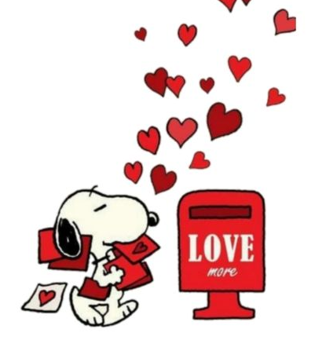

<html lang="es">
<head>
<meta charset="utf-8" />
<meta name="viewport" content="width=device-width,initial-scale=1" />
<title>Página sorpresa</title>

</head>
<body>
<main class="stage">
<section class="intro" id="intro">

<h1>Tienes un mensaje 💌</h1>

Haz clic en abrir y sigue las pistas para ver la sorpresa.

  <button class="btn" id="openBtn">Abrir</button>
  

    <input class="code-input" id="codeInput" placeholder="Ingresa el código" aria-label="Código" />
    <button class="btn" id="checkBtn">Enviar</button>
  

  
Pista: Es una fecha muy importante para los dos.

<!-- Carousel oculto inicialmente -->

  

    

      

      

    

  

</section>

<!-- Página sorpresa sonido -->

  

    

      
    

    

      <video src="tocadiscos.mp4" autoplay loop muted style="width:100%; height:400px; border-radius:12px; object-fit:cover; background:black; position:relative; z-index:10;"></video>
    

  

  

    

    <audio src="lala.mp3" controls style="width:90%; height:30px;"></audio>
  

  <button class="backBtn">&#10148; Volver</button>

<!-- Página sorpresa carta con buzón -->

  

    

      <h3>BUZÓN</h3>
      

    

    

      

      

¡Aquí está tu mensaje secreto!

      <button onclick="cerrarTarjeta()" style="position:absolute; bottom:5px; right:5px; padding:4px 8px; background:#e64a6b; color:white; border:none; border-radius:6px; cursor:pointer;">Cerrar</button>
    

  

  <button class="backBtn">&#10148; Volver</button>

</main>

</body>
</html>
